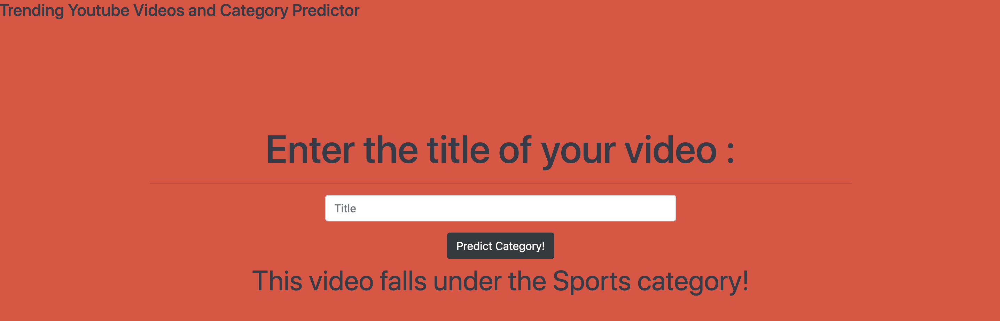
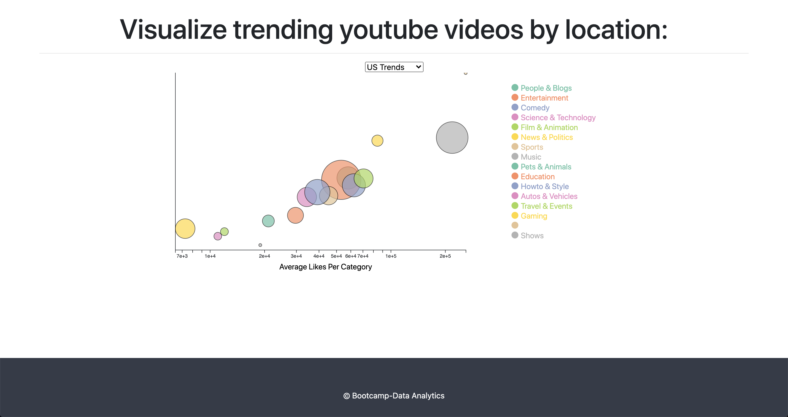
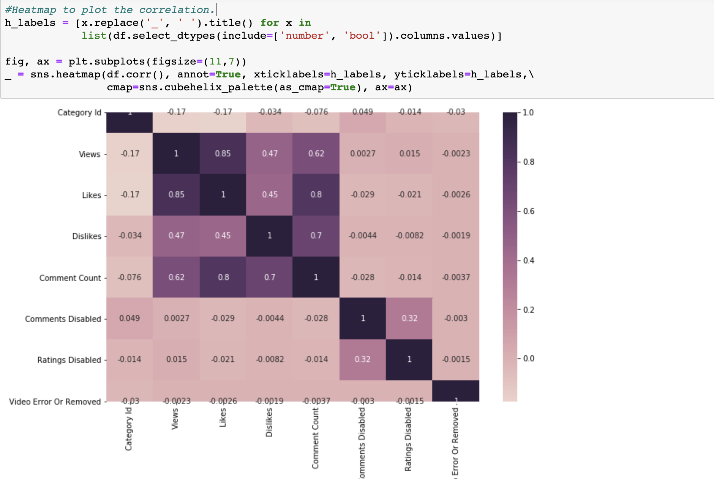
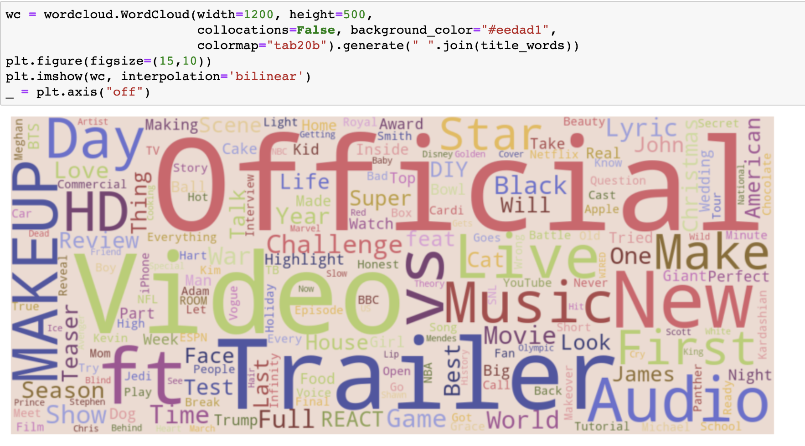

# Trending-Youtube-Videos_Analysis and Category predictor

Bubble plots visualizations using D3 of trending youtube videos from different locations(US, CA). Use of Naive Bayes classifier model to predict what category a video belongs to based on the title. 

## Heatmap of correlation matrix

## Most common words in video titles

## Published time

## Review the project outline

Python: pandas, pymongo, flask, Naive Bayes model("probabilistic classifier"), spark (work in progress): tokenizer, hashing
Javascript: D3: event handlers, svg's, tool tips
html & css: forms
Procedure followed:

1 : Data in csv format is obtained from: 
https://www.kaggle.com/datasnaek/youtube-new#USvideos.csv
https://www.kaggle.com/datasnaek/youtube-new#CAvideos.csv

2. Data is inspected and prepared using panda dataframes

3. Dataframes are converted to dictionaries and fed to mongoDB 

4. Create a flask app that accesses our data from mongodb and later passes this data to a javascript program upon request. 

Using Javascript: 

Receive data from our flask app and do some analysis by grouping videos by category and generating a summary of the categories such as:
- average likes 
- average comments
- average dislikes
- average views 

6. Create an svg and create a bubble plot that holds some info of the category summmaries. Data visualizations are available for CA and US Trending youtube videos.

7. Use the Naive Bayes model to predict the category a video belongs to given the Title of the video. 

## Technology Used

